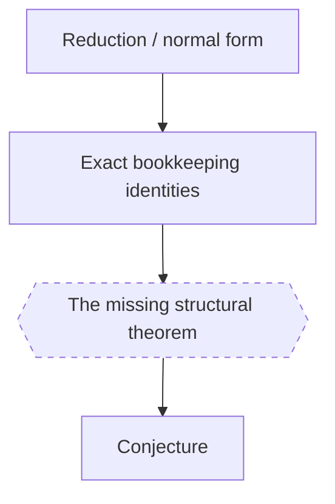

# Program map

**Updated:** {{DATE}}
**Role:** the route map — everything proved, refuted, open, or in flight, in
diagram form, plus the critical path in one line. Rendered to
`program_map.html` by `tools/render_docs.py`.

## The critical path in one line

{{…}}

## Plan A — the proved spine

Legend: solid = proved; dashed = open; annotate refuted nodes explicitly and
link them to [`../REFUTED_CONJECTURES.md`](../REFUTED_CONJECTURES.md).

## Plan B — routes and coverage

{{A second diagram organised by route rather than by dependency: each
alternative approach, its status, and where it would rejoin the spine.
Neither diagram subsumes the other.}}
